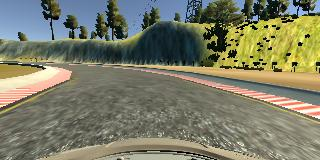
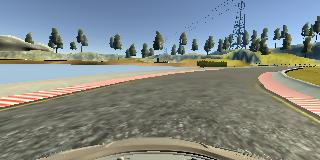

# Use Deep Learning to Clone Driving Behavior
The project explores building a Deep Neural Network (DNN) and training it for autonomous driving a car in the simulation.

## Neural Network Architecture
The architecture is inspired by the NVidia paper [End to End Learning for Self-Driving Cars](http://images.nvidia.com/content/tegra/automotive/images/2016/solutions/pdf/end-to-end-dl-using-px.pdf):


After the initial model implementation and the first successful lap, I realized that the model was used for a pretty tough problem of driving real roads in real weather conditions, so I tried to simplify it by removing a convolutional layer, or a fully-connected layer, or reducing number of filters in any convolutional layer, or reducing number of neurons in the fully-connected layer - but each attempt resulted in a worse model performance. The model seems pretty well balanced:
* First three convolutional layes with kernel size 5x5 are enough for extracting features of three different scales from the original images. The depth of the first layers 24-36-48 must provide enough capacity for all possible low-level features seen on the track.
* The following two high-depth convolutionl layers should be able to extract pretty complex features out from the third high-scale feature layer. The capacity of these two layers is 64-64. 
* The three fully connected layers provide a good non-linearity for translating the complex features extracted by the convolutional layers into the steering commands. Number of neurons across these layers decreases from 100 designed to capture the features extracted by the convolutional layers, to 10 neurons connected to the output. The three-layer "controller" of capacity 100-50-10 should be able to model functions of a high order.

So in the end I decided to stick to the NVidia solution:
```
____________________________________________________________________________________________________
Layer (type)                     Output Shape          Param #     Connected to
====================================================================================================
convolution2d_1 (Convolution2D)  (None, 30, 98, 24)    1824        convolution2d_input_1[0][0]
____________________________________________________________________________________________________
convolution2d_2 (Convolution2D)  (None, 13, 47, 36)    21636       convolution2d_1[0][0]
____________________________________________________________________________________________________
convolution2d_3 (Convolution2D)  (None, 5, 22, 48)     43248       convolution2d_2[0][0]
____________________________________________________________________________________________________
convolution2d_4 (Convolution2D)  (None, 3, 20, 64)     27712       convolution2d_3[0][0]
____________________________________________________________________________________________________
convolution2d_5 (Convolution2D)  (None, 1, 18, 64)     36928       convolution2d_4[0][0]
____________________________________________________________________________________________________
flatten_1 (Flatten)              (None, 1152)          0           convolution2d_5[0][0]
____________________________________________________________________________________________________
dense_1 (Dense)                  (None, 100)           115300      flatten_1[0][0]
____________________________________________________________________________________________________
dropout_1 (Dropout)              (None, 100)           0           dense_1[0][0]
____________________________________________________________________________________________________
dense_2 (Dense)                  (None, 50)            5050        dropout_1[0][0]
____________________________________________________________________________________________________
dropout_2 (Dropout)              (None, 50)            0           dense_2[0][0]
____________________________________________________________________________________________________
dense_3 (Dense)                  (None, 10)            510         dropout_2[0][0]
____________________________________________________________________________________________________
dropout_3 (Dropout)              (None, 10)            0           dense_3[0][0]
____________________________________________________________________________________________________
dense_4 (Dense)                  (None, 1)             11          dropout_3[0][0]
====================================================================================================
Total params: 252,219
Trainable params: 252,219
Non-trainable params: 0
____________________________________________________________________________________________________
```

## Activations
I started with a classical Tanh-activation in all layers, but the model could barely learn how to pass the first curve. I think that saturated neurons based on Tanh and Sigmoid functions are not good for such a problem, since they cause the vanishing gradiend before the network learns enough. ReLU and ELU demonstrated similar good performance (ReLU appeared to converge faster), but I guess they both suffered from sudden death at high learning rates. Even though I didn't visualize activations, but I observed random minimal loss of a big difference across multiple training sessions without changing the learning rate and other metaparameters. I explain that by the different death rate over multiple runs, which could greately affect the validation/test results due to comparatively small overall number of neurons. ReLU-activation has been chosen.

## Regularization
Multiple methods have been tried with the model:
* The sample images are normalized in RGB colorspace. This basic regularization is essential for the model to learn anything reliably.
* L2-regularization is applied to all weights with lambda=1e-5. A higher value of lambda would affect the training time with not much effect on the genralization.
* Dropout is applied to all fully-connected neurons. It demonstrated a significant inprovement in the final loss and the overall model performance on track. The dropout probability is chosen 0.5
* Batch Normalization was tried to be applied to all convolutional layers before or after the activations. Either way it significantly improved the loss after only a few epochs, but for some reason didn't improve the model performance on track, discarded.

## Other Metaparameters
The batch size is chosen 256. A larger batch size of 512 or 1024 would require a really powerful GPU and reduce number of backpropagations per epoch. The base number of epochs is 15, however the model was addiotionally trained at a lower learning rate after the initial testing on track.

## Training/Validation/Testing Sets
All training data was captured by driving the car on track one. Five laps was driven either direction: clockwise and counterclockwise. The image capture rate is default - 10Hz. A Sony PlayStation3 controller was used to get smooth steering angles. The total number of samples is about 10k. Each sample contains three images for center, left and right cameras.

### Training Set
The original samples are not suitable for direct training since the probability distribution of steering angles indicates a significantly higher rate of straight driving samples, rather than steering ones. Thus the training set is dynamically generated by a generator. The original samples are passed through the pipeline:

1. Camera is randomply selected from the center, left or right camera. If a side camera is selected, the original angle is adjusted by 0.25.
2. Bottom 15% of the image is cropped to remove the car hood and avoid the modem to learn the feature.
3. The image is randomly shifted vertically and horizontally, taking into account the angle/pixel ratio of side cameras which is 0.25 per 40px. The horizontal shift helps to model different views of the track, which are never seen in the captured samples. The vertical shifts model unseen slopes.
4. Top 25% of the image is cropped to remove the useless and distracting features of the sky, high hills and trees.
5. Brightness is randomly shifted to model unseen reflections and shadows, the multiplier is 0.25..1.50 applied to the original brightness.
6. Each sample is randomly flipped to model unseen curves.
7. The image is resized in order to match the expected input size of the NVidia model.
8. A Min-Max normalization is applied to the image in order to shift the mean and regularize the min-max value span.

Here's an example of the augmented sample:

Action | Image
---|:---:
Original left image (adjusted angle=0.26) | 
Cropped hood | 
Shifted (adjusted angle=0.04) | 
Cropped sky | 
Raised brightness | 
Resized | 
Normalized | 

The training set generator is adjusted every epoch: the probability of discarding a randomly generated straight driving sample is monotonically decreased from 1.0 to 0.0. If makes the model to learn steering first, which prevents it from getting biased to straight driving. However my final model weights are a little bit biased to steering. A straight driving is considered to have steering angle below 0.1. The training set size is 102400.

### Validation Set
The validation set is randomply created by the same generator from the original samples without discarding any stright driving samples. The validation set size is 20% of the training set size.

### Testing Set
This is just a set of center camera samples from the original sample set. The samples are never shown to the model as-is, but rather used to create the jittered training/validation set, so it could serve a good source of the testing data. All images are cropped, resized and normalized. Besides the testing, there's a sanity check, which provides a visible estimate of the rough model performance:


Expected steering angle | Image
---:|:---:
-0.25 | 
0.00 | 
+0.25 | 

## Testing Results
The submitted weights were obtained by training the described model for 15 epochs. The resulting test set loss is 0.007, which is a rough indication of a good model. Only test driving on track can prove the correctness. The model is able to drive Track 1 indefinitely at the highest throttle of 0.3 (30 MPH), never crossing yellow lines. Moreover the model is able to drive a big portion of Track 2, failing to pass a really tough curve a few minutes after start.

## How to Test Model
Install the [CarND Term1 Starter Kit](https://github.com/udacity/CarND-Term1-Starter-Kit/blob/master/README.md). Download the simulator for [macOS](https://d17h27t6h515a5.cloudfront.net/topher/2016/November/5831f290_simulator-macos/simulator-macos.zip), or [Linux](https://d17h27t6h515a5.cloudfront.net/topher/2016/November/5831f0f7_simulator-linux/simulator-linux.zip), or [Windows](https://d17h27t6h515a5.cloudfront.net/topher/2016/November/5831f3a4_simulator-windows-64/simulator-windows-64.zip). Clone this repo nad start the driving script:
```
tmp vernor$ git clone https://github.com/vernor1/behavioral_cloning.git
Cloning into 'behavioral_cloning'...
remote: Counting objects: 79, done.
remote: Compressing objects: 100% (51/51), done.
remote: Total 79 (delta 32), reused 69 (delta 25), pack-reused 0
Unpacking objects: 100% (79/79), done.
tmp vernor$ cd behavioral_cloning
behavioral_cloning vernor$ source activate carnd-term1
(carnd-term1) behavioral_cloning vernor$ python drive.py model.json
Using TensorFlow backend.
(53208) wsgi starting up on http://0.0.0.0:4567
```
Then start the simulation and watch the autonomous driving! Watch the sample video of the car driving Track 1:

[](http://www.youtube.com/watch?v=uT5Rhpd_gJ8 "Behavioral Cloning")
